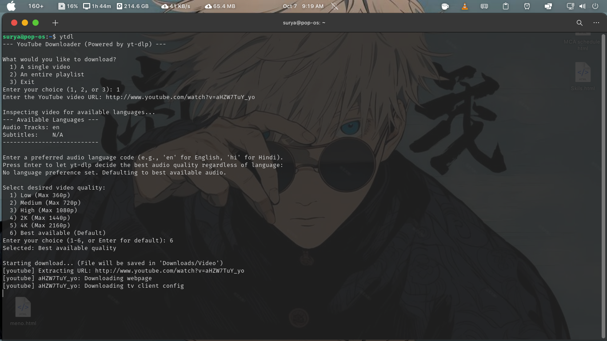
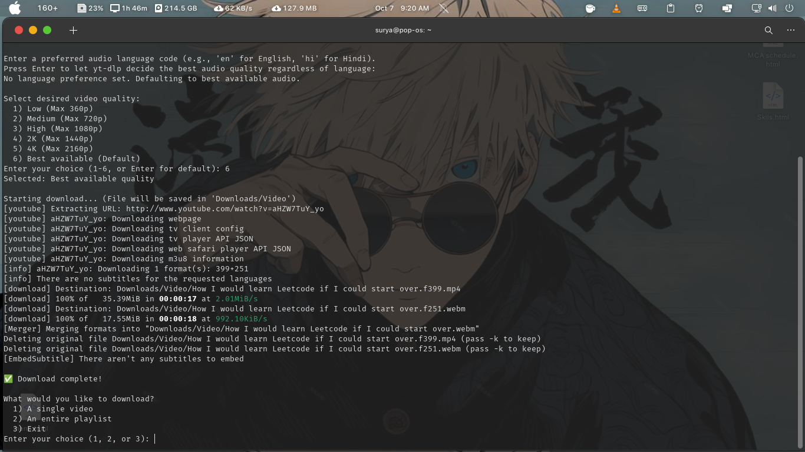

# 🎥 YouTube Downloader CLI ✨  

A simple, yet powerful **command-line tool** built in Python to download YouTube videos and playlists — with **audio language**, **subtitle**, and **quality selection** support.  

---

## 🚀 Features  

- ✅ **Download anything:** Grab single videos or entire playlists effortlessly.  
- ✅ **Quality control:** Choose your desired resolution — from 360p to 4K.  
- ✅ **Multilingual audio:** Select your preferred audio language track (if available).  
- ✅ **Smart subtitles:** Automatically embeds English (`en`) and Hindi (`hi`) subtitles (if available).  
- ✅ **Progress tracking:** Beautiful live download progress bar with details.  

---

## 🎬 How It Looks  

**1. Inspecting Video Languages**  
*After pasting a video URL, it fetches available audio and subtitle options*  

  

**2. Language and Quality Selection**  
*Choosing audio language and video resolution*  

  

**3. Downloading with Progress**  
*Visualizing the download progress*  

  

---

## 📦 Requirements  

- **Python 3.x**  
- [`yt-dlp`](https://github.com/yt-dlp/yt-dlp) – The powerful core library for video downloading  
- [`ffmpeg`](https://ffmpeg.org/) – Required for merging audio/video and embedding subtitles  

---

## 🛠️ Installation  

1. **Clone the repository:**  
   ```bash
   git clone https://github.com/joyboi-ai/Video-Downloader.git
   cd Video-Downloader
   ```

2. **Install dependencies:**  
   ```bash
   pip install -U yt-dlp
   sudo apt update && sudo apt install ffmpeg
   ```
   *(For other OS, visit [ffmpeg.org/download.html](https://ffmpeg.org/download.html))*

3. **Make the script executable and create a global command:**  
   ```bash
   chmod +x main.py
   sudo ln -s "$(pwd)/main.py" /usr/local/bin/ytdl
   ```
   *(If `ytdl` isn’t recognized, restart your terminal or run `source ~/.bashrc`)*

---

## 💡 Usage

Simply run the downloader:

```bash
ytdl
```

You’ll then be prompted to:

- Paste a YouTube video or playlist URL
- Select your preferred audio language
- Choose your desired video quality
- Watch your downloads complete with subtitles and progress tracking!

---

## ❤️ Support the Project

If you found this tool helpful, please give the repo a ⭐ on GitHub!  
Your support motivates further development and new features.

👉 [Like & Star the Repo](https://github.com/joyboi-ai/Video-Downloader)

---

## 📜 License

This project is licensed under the MIT License — free to use, modify, and distribute.

```text
MIT License  
Copyright (c) 2025 joyboi-ai
```
